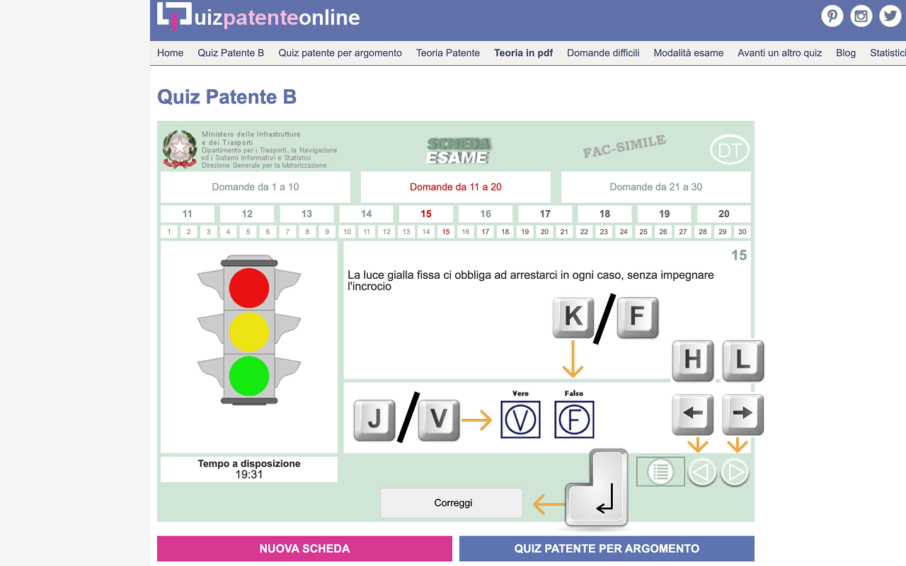

#  Italian License Quiz Shortcuts 🚗💨 📝

A Chrome extension that adds keyboard shortcuts to [quizpatenteonline.it](https://www.quizpatenteonline.it/) to make studying for the Italian driver's license more efficient.

## Features

- **Keyboard Navigation**: Move between questions without using your mouse
- **Quick Answer Selection**: Select "Vero" (True) or "Falso" (False) with a single keystroke
- **Form Submission**: Submit your answers with the Enter key
- **Clean Interface**: Removes unnecessary elements for a more focused study experience

## Keyboard Shortcuts

| Key                     | Action                      |
|-------------------------|----------------------------|
| `→` (Arrow Right) or `l` or `Space` | Go to next question          |
| `←` (Arrow Left) or `h` | Go to previous question      |
| `v` or `j`              | Select "Vero" (True) answer  |
| `f` or `k`              | Select "Falso" (False) answer |
| `Enter`                 | Submit answers (click "Correggi" button) |

## Installation

### From Chrome Web Store

### Manual Installation

#### Option 1: Install from GitHub Releases
1. Download the latest `.zip` file from the [GitHub Releases page](https://github.com/MrTartuf0/quiz-patente-shortcuts/releases/tag/extension).
2. Extract the `.zip` file to a folder on your computer.
3. Open Chrome and navigate to `chrome://extensions/`.
4. Enable "Developer mode" (toggle in the top-right corner).
5. Click "Load unpacked" and select the extracted folder.
6. The extension is now installed and active when you visit quizpatenteonline.it.

#### Option 2: Install from Source Code
1. Clone or download this repository.
2. Open Chrome and navigate to `chrome://extensions/`.
3. Enable "Developer mode" (toggle in the top-right corner).
4. Click "Load unpacked" and select the folder containing the extension files.
5. The extension is now installed and active when you visit quizpatenteonline.it.

## Why Use This Extension?

When studying for the Italian driver's license (Patente B), you'll answer hundreds of practice questions. This extension helps you:

- **Save Time**: No more constantly switching between keyboard and mouse
- **Focus Better**: Cleaner interface with fewer distractions
- **Study Efficiently**: Vim-inspired keyboard shortcuts for rapid navigation and selection
- **Complete Tests Faster**: Optimize your workflow for quiz completion

## Permissions

This extension only requires:
- **activeTab**: To interact with the quiz website when you're actively on it

It does not collect any personal data or track your browsing activity.

## Contributing

Contributions are welcome! Feel free to:
1. Open issues for bugs or feature requests
2. Submit pull requests with improvements
3. Share feedback on usability

## License

[MIT License](LICENSE)

## Acknowledgements

- Built for all driving test candidates studying in Italy
- Inspired by the efficiency of Vim keyboard shortcuts
